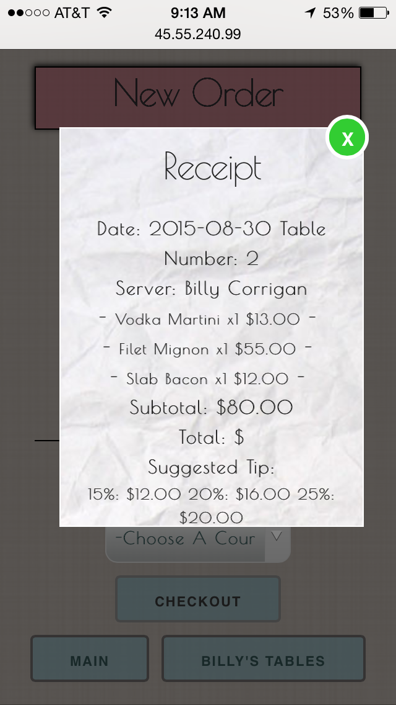

##TableTurn

- TableTurn is a mobile-optimized restaurant management application with a particular focus on the facilitation of order generation by waitstaff.

---


---

- Each server can select among their upcoming and open tables for the day.

---


---
- On the order page, food items are added to the tab by dropdown menu, and additional information about an item can be retrieved by clicking on it.

---


---

- The checkout button will generate a receipt of all items, along with suggested tips. Clicking on a chosen tip will produce a final total. Exiting out of the receipt will close the order.

---



---

- TableTurn also supports a variety of funcionality for administrative staff, which will be accessible only by login in subsequent versions.

---


---

- Functionality includes complete management of  waitstaff, menu and reservations, including creation, editing and deletion of all items.

---


---

- Reservations are booked by date and time, with unbooked tables marked with green, and booked tables marked with red

---


---

- Kitchen staff can view orders as they come in, with colors indicating length of time since the order was placed (Desktop only)

---


---


##url

http://http://45.55.240.99/

---

##Wireframe


---

##ERD


---

##Code Snippets

* This ruby method accepts an array of orders as an argument, and returns an array of arrays containing each food ordered, the quantity ordered, and the item price, to be used for generating a party receipt.  

```
def self.receipt(orders)
  foods = Food.all
  foodsHash = {}
  foods.each do |food|
    foodsHash[food.name] = [0, food.price]
  end
  foodsHash.each do |key, value|
    orders.each do |order|
      if key == order.food.name
        foodsHash[key][0]+=1
      end
    end
  end
  receipt = []
  foodsHash.each do |key, value|
    if value[0]>0
      receipt.push([key, value[0], value[1]])
    end
  end
  receipt
end
```

* This jQuery/JavaScript fragment determines the length of time since an order was placed, and changes the color of the order if certain time thresholds have been passed.

```
var d = $('.kitchen');
for (var i =0; i<d.length; i++){
  var timeDiff = (Date.parse(new Date()) - Date.parse(d[i].getAttribute("data-start-time")))/60000;
  if (timeDiff > 15) {
    d[i].style.backgroundColor =  'rgb(231, 57, 57)';
  } else if (timeDiff > 5 && timeDiff <=15) {
    d[i].style.backgroundColor =  'orange';
  }
}
```
